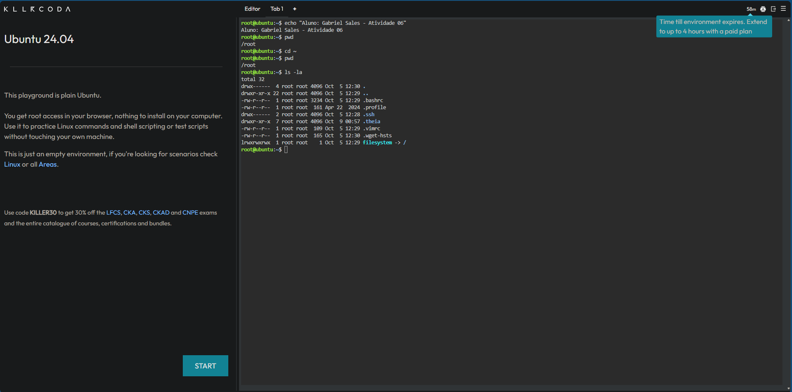
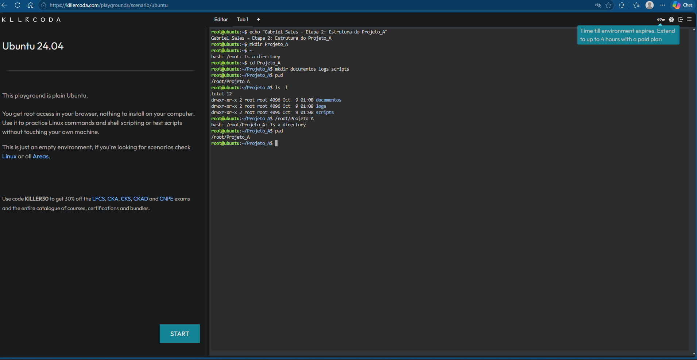
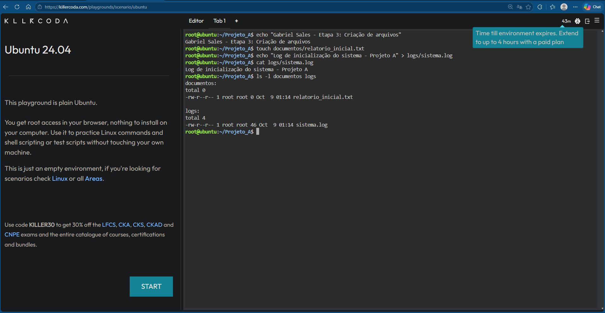
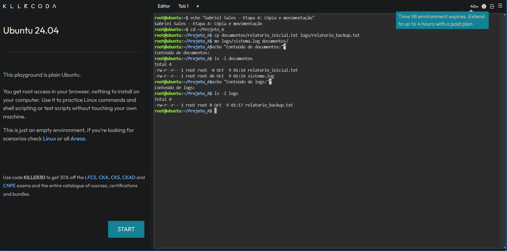
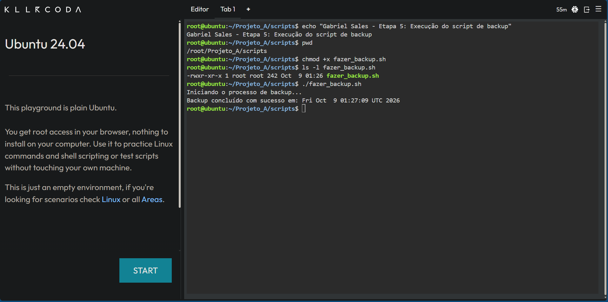
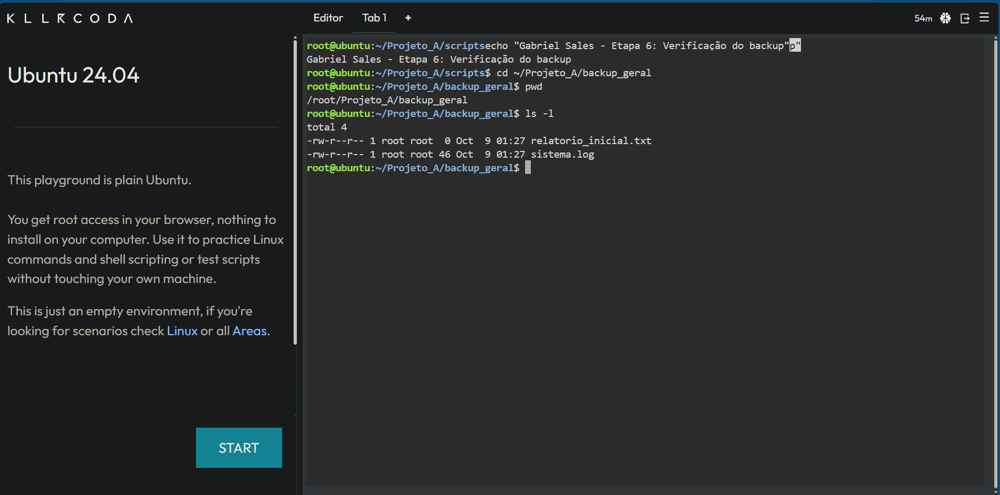

# Atividade 06 — Arquivos, diretórios e Shell Script

Nesta atividade, pratiquei alguns comandos básicos do Linux para navegar entre diretórios, criar pastas e arquivos, copiar e mover arquivos.

Também criei um Shell Script chamado `fazer_backup.sh`. Esse script cria a pasta `backup_geral` e copia para ela todos os arquivos que estão no diretório `documentos`.

## Comandos praticados

Durante a atividade, utilizei comandos como:

- `pwd`
- `cd`
- `ls`
- `mkdir`
- `touch`
- `echo`
- `cat`
- `cp`
- `mv`
- `chmod`

## Script de backup

O script recebeu permissão de execução com:

```bash
chmod +x fazer_backup.sh

```

Depois, executei o script com:

```bash
./fazer_backup.sh
```

Ao final, confirmei que os arquivos `relatorio_inicial.txt` e `sistema.log` foram copiados corretamente para a pasta `backup_geral`.

## Evidências

### Etapa 1 — Navegação e inspeção



### Etapa 2 — Criação dos diretórios



### Etapa 3 — Criação dos arquivos



### Etapa 4 — Cópia e movimentação



### Etapa 5 — Execução do script



### Etapa 6 — Verificação do backup



## Aluno

Gabriel Sales
